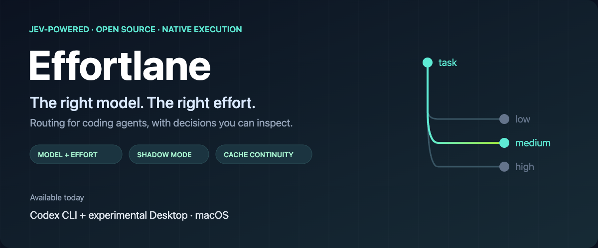
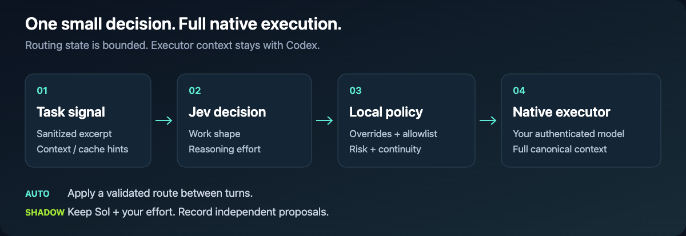
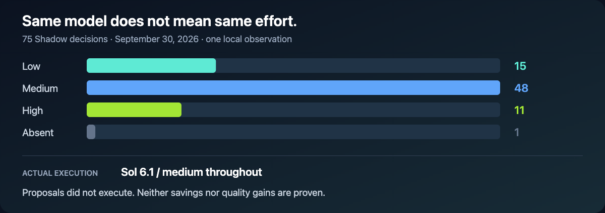

<div align="center">



# Effortlane

**Model and reasoning-effort routing for coding agents. Powered by Jev.**

Current integration: Codex on macOS. Keep your ChatGPT login and native executor.

[](https://github.com/itscloud0/effortlane/actions/workflows/tests.yml)
[](LICENSE)


[Quick start](#quick-start) · [How it works](#how-it-works) · [Evidence](#what-we-have-measured) · [Configuration](#configuration) · [Documentation](#documentation)

</div>

## Why this exists

A cheaper inference is not necessarily a cheaper completed task. Retries, rework, context reconstruction, and cold caches can erase the saving.

This project explores **less Pro allowance used per correctly completed task**. Jev makes a small routing decision; your authenticated Codex model does the work with its canonical context. Switching happens between user turns, not after every thought or tool call.

> [!IMPORTANT]
> **Experimental, macOS-only. Pro allowance savings and engineering-quality improvements are not yet proven.** CLI routing is implemented. Desktop integration is opt-in and relies on an undocumented app override; revalidate built-in tools after updates. Coding execution uses native ChatGPT/Codex authentication. Jev decisions are a separate vendor service and may have their own cost.

## Quick start

Requirements: macOS, Python 3.11+, native Codex installed and signed in, and a TypeSafe/Jev key.

```sh
git clone https://github.com/itscloud0/effortlane.git
cd effortlane
python3 bootstrap.py
jev-codex doctor
codex
```

The installer asks for the Jev key with hidden input, backs up existing Codex configuration, and installs at user level. It never asks you to paste a key into a GitHub issue. No per-repository setup is required. If `~/.local/bin` is not first on your `PATH`, the installer prints the remaining shell step.

Already installed? See [update and recovery](docs/OPERATIONS.md#report). Renaming this GitHub repository does not change your local `jev-codex` command or installation directory.

### Pick how much control to give Jev

| Selection | Actual executor | Model and effort decision |
|---|---|---|
| **Jev Auto** | An allowed native Codex model | Jev proposes both; local policy validates the decision |
| **Jev Shadow** | Latest Sol exposed by that client | Your selected effort executes; Jev independently records a proposal |
| **Concrete model** | Your selected model | Manual model choice bypasses automatic routing |

```sh
codex --jev-shadow             # observe decisions without applying them
codex exec --jev-shadow "Explain this module"
jev-codex status
jev-codex trace THREAD_UUID
```

Desktop stays native until you explicitly run `jev-codex desktop-enable` and restart the app. `jev-codex desktop-safe` restores native Desktop if compatibility regresses; restart afterward. [Desktop compatibility details](docs/OPERATIONS.md#limits).

## How it works



1. **Describe the task, briefly.** A bounded, sanitized routing dossier omits repository source, complete conversations, tool output, and credential-like values.
2. **Ask Jev.** Typed choices propose work shape and reasoning effort.
3. **Apply local policy.** Respect manual choices, account model availability, allowlists, risk floors, and route continuity. A conservative cache guard delays some downgrades; capability upgrades are immediate.
4. **Execute natively.** Codex retains its canonical context and ChatGPT login. The coding model is not silently moved to a separately billed OpenAI or OpenRouter API.
5. **Measure metadata.** Record model, effort, available token/cache counters, latency, and route linkage. Full prompts and source are not logged by default.

The router selects an executor; it does **not** autonomously split tasks or spawn subagents. Native Codex decides delegation. There is no background repository indexer or always-running planning swarm.

## What we have measured

**Dated local observation · September 30, 2026 · one Mac · not a benchmark.**

| Observation | Result | What it establishes |
|---|---:|---|
| Shadow routing decisions | 75 across 17 sessions | Decisions were recorded in CLI and Desktop |
| Exactly linked executor-call records | 71 | Traceable usage for this subset; four decisions lack a linked call |
| Actual Shadow executor | GPT-6.1 Sol / medium | A stable baseline, not executed Jev savings |
| Proposed model | 67 Sol · 7 Luna · 1 absent | The policy remains conservative |
| Cached input in linked records | 95.7% | Observed cache reuse, not a benefit attributable to Jev |
| Median measured Jev latency | 356 ms | Decision overhead in this sample |

**Jev also proposed effort changes.** Model selection alone misses part of the policy.



Six Luna proposals were held by the cache guard. Lower effort might save allowance, or might cause expensive rework. Shadow did not execute those proposals, so neither result has been demonstrated.

The observed account-wide weekly Pro meter rose from **4% to 9%** over approximately fourteen elapsed hours without a reset. Other chats and modes shared that allowance, and the period was not entirely Shadow. This is **not a router savings claim**. Desktop telemetry may contain only the last model call of a turn.

[Full evidence and limitations](SHADOW_COMPARISON.md). Long-term evaluation should compare subscription allowance, accepted work, elapsed time, and rework across comparable periods. API-price simulations are secondary diagnostics, not subscription economics.

```sh
jev-codex evaluate --hours 168
jev-codex savings --hours 168
```

The `savings` command includes token-rate counterfactuals. Its output does not prove saved Pro allowance. Neither token totals nor successful tool exits alone establish completed-task quality.

## Configuration

Policy lives at `~/.local/share/jev-codex-router/config.json`; use [policy.example.json](policy.example.json) and the [policy reference](docs/OPERATIONS.md#policy-configuration).

- **Model allowlist:** Astra is excluded from automatic selection by default.
- **Effort:** Jev can propose effort independently; Shadow preserves the executor effort you select.
- **Continuity:** Avoid gratuitous model switching during a long task. Cache affinity cannot block a needed capability upgrade.
- **Privacy and fallback:** If Jev times out, fails, or lacks enough safe signal, use a conservative native Sol fallback.
- **Discovery:** Desktop and standalone CLI each use their own authenticated native model catalog.

Local services bind only to `127.0.0.1`. Credentials stay in owner-only local files. This is an independent community project, not an official OpenAI or TypeSafe product. See [SECURITY.md](SECURITY.md).

## Disable and recover

```sh
jev-codex disable          # disable routing
codex-native              # explicit native CLI bypass
jev-codex desktop-safe    # restore native Desktop; restart the app
jev-codex rollback        # restore backed-up managed installation settings
```

Ownership checks preserve unrelated or manually changed files. The installer does not modify the ChatGPT app bundle, delete sessions, or log you out. [Full recovery procedures](docs/OPERATIONS.md#limits).

## Documentation

- [Operations, installation, policy, updates, and known limitations](docs/OPERATIONS.md)
- [Measurement history and evidence](SHADOW_COMPARISON.md)
- [Contributing and reporting useful measurements](CONTRIBUTING.md)
- [Security](SECURITY.md)
- [Related implementations and attribution](docs/OPERATIONS.md#related-work)

## Integration roadmap

| Integration | Status |
|---|---|
| Codex CLI on macOS | Implemented; validate against your installed release |
| Codex Desktop on macOS | Experimental, opt-in |
| Claude Code | Future work; not implemented |
| Windows | Future work; not implemented |

The independent project name leaves room for additional adapters. It does not imply cross-client or cross-platform support today.

## Help make routing measurable

Reproducible bugs, compatibility checks, and long-term outcome measurements are more valuable than unverified savings percentages. Please report sanitized metadata; never attach your auth file, API key, full rollout, or proprietary prompts.

If this project is useful to you, a star helps others discover it. Contributions are welcome under the [MIT license](LICENSE).
