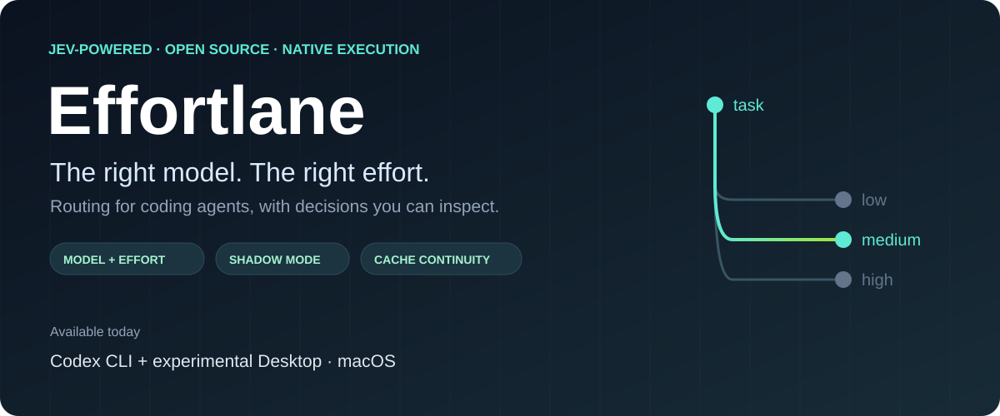

<div align="center">



# Codex Jev Native Router

**A small decision layer for Codex Desktop and CLI. Codex still does the coding.**

[](https://github.com/itscloud0/codex-jev-native-router/actions/workflows/tests.yml)
[](LICENSE)


[](https://github.com/itscloud0/codex-jev-native-router/stargazers)

[How it works](#what-auto-actually-does) · [Install](#install-and-controls) · [Configure](#policy-configuration) · [Measure](#report) · [Limits](#limits)

</div>

> [!IMPORTANT]
> **Experimental, macOS-only.** Local and CI tests pass, but quality-equivalent
> ChatGPT Pro allowance savings have **not** been demonstrated. Desktop integration
> depends on an undocumented Codex launch override and needs rechecking after updates.

| Mode | Executor | What Jev does |
| --- | --- | --- |
| **Jev Auto** | Native Codex model selected for this turn | Classifies work shape and reasoning effort |
| **Jev Shadow** | Sol | Records the route Auto would propose |
| **Concrete model** | Your selection | Bypassed; manual choice wins |

> [!NOTE]
> The default Auto allowlist is Luna, Terra and Sol; the current credit-rate
> guard excludes dominated Terra when GPT-6 Sol is available. Astra remains a manual
> choice until its automatic use is justified by real outcome data. The
> Desktop picker may show Medium for the alias; Auto chooses the executor's
> actual effort separately. Inspect it with `jev-codex route THREAD_UUID`.

Local, owner-only Codex model router. Desktop uses an app-server stdio adapter. Interactive CLI uses the original Codex TUI through its supported `--remote` connection, bridged locally to the same adapter. Both select model and effort before each turn; the native executor connects directly to the official ChatGPT Codex endpoint. `codex exec PROMPT` selects a concrete native model before launch and uses a loopback Responses gateway for usage telemetry. Authentication stays with the built-in Codex OpenAI provider. Jev receives only a bounded, sanitized task excerpt; its key is read from an owner-only file passed at install time or `~/.config/jev-codex-router/typesafe-api-key`. The gateway does not forward Codex bearer headers to Jev.

The sanitizer retains a clear instruction before an unfenced code appendix and removes the code, paths, URLs, and credential-like values before calling Jev. If the instruction is absent or most meaning is redacted, Auto uses Sol locally. The global `mode` is a kill switch when set to `off`; otherwise the selected `Jev Auto` or `Jev Shadow` alias determines the mode for that turn.

## What Auto actually does

`Jev Auto` is a picker alias, not an executor model. On each new Desktop or interactive CLI user turn, the local policy checks the model allowlist, a bounded task excerpt, risk floor, prior route lease and context/cache hints. Under the default `completion_v4` policy, Jev answers two typed questions in one call: work shape (`mechanical`, `routine`, `substantive`, `unknown`, or `frontier` when Astra is allowed) and reasoning effort (`low`, `medium`, `high`, or `xhigh`). Local code maps the work shape to an eligible concrete model, validates capabilities and applies the switch guard. Codex then executes the whole turn with that model, its native instructions, full conversation and existing ChatGPT login. Tool calls within the turn do not trigger another route. `codex exec` routes its initial prompt before launch.

With `completion_v4`, Auto remembers only the previous work-shape category and native route for one hour. A bare "continue" or "продолжай" in the same Desktop task can reuse that route without another Jev call if the model remains allowed and no concrete-model switch or effort override occurred. New or mixed instructions use the normal routing policy. No task text, source, or tool output is stored in the route lease. This saves a Jev call and preserves model affinity; it does not establish Pro allowance savings. `jev-codex report` counts `continuation_lease` and `cache_hysteresis` decisions under `routes.reasons` and v4 work-shape categories under `routes.by_policy.completion_v4.work_shapes`.

An explicit concrete model bypasses Auto. In Desktop, Jev Auto chooses **both** model and effort; the Desktop effort picker is ignored for Auto because its value can persist from a previous concrete model. For a fixed effort, use `effort_policy=fixed` in router config or choose a concrete model. If the task excerpt is unsafe or unsuitable to send to Jev, the router uses Sol without calling Jev (`privacy_fallback`). Shadow only records a proposal while Sol executes. This is **model/effort routing**, not automatic subagent orchestration.

Jev does not choose whether to spawn subagents or assign their models. Without a separate Codex subagent setting, a child inherits its parent's model and effort. [Codex supports personal custom agents](https://learn.chatgpt.com/docs/agent-configuration/subagents) in `~/.codex/agents/`; optional [explorer](examples/agents/explorer.toml) and [mechanical](examples/agents/mechanical.toml) examples use Luna/high for bounded searches and edits, while [routine](examples/agents/routine.toml) uses Terra/medium for isolated routine engineering. They must be explicitly selected by the parent agent or guided by global `~/.codex/AGENTS.md` instructions. Do not set every child to Luna: substantive implementation and debugging may need Sol, and extra agents add their own context cost. No per-repository files are required for personal agents.

For long tasks, keep the main executor on its route lease and delegate only independent, bounded work with a clear owner; this avoids repeatedly moving the full conversation between models. Keep parallel children modest on memory-constrained Macs, and verify their changes in the parent. Use Desktop when its visual tools or parallel worktrees help, and CLI for focused tasks where the app UI adds no value. The native Codex TUI also routes before each turn through a local app-server bridge. Use CI for deterministic checks, not as an assumed substitute for locally authenticated Codex execution.

For context efficiency, keep global guidance short, use bounded searches to find task-relevant files, and read sections only when needed. Preserve decisions and verified state in a handoff when moving to a fresh task; recheck that handoff against the live working tree. This uses Codex's native tools and compaction rather than pushing full repositories into Jev or adding a background indexer. It is a workflow policy, not an automatic semantic retrieval engine, and has not been shown to reduce tokens on its own.

The router does not manage Desktop's renderer, Computer Use workers, or per-thread MCP processes. On a 16 GiB Mac, one live investigation found hundreds of Desktop descendants and swap near full while the router itself remained small; this resembles [Codex issue #44996](https://github.com/openai/codex/issues/44996) and [#46799](https://github.com/openai/codex/issues/46799), but the exact cause on that Mac is unproven. Prefer CLI for focused tool-heavy work when Desktop's UI is unnecessary, close idle Desktop tasks, and inspect the process tree before disabling a plugin. Do not delete persisted session data to treat an active process problem.

The Desktop effort picker is Codex's native model-effort control, not an extensible routing-mode menu. Jev aliases now advertise a single effort to avoid presenting choices that Auto ignores. Desktop may still display `Medium`; it is only alias metadata, **not** the actual executor effort. `jev-codex route THREAD_UUID` shows the last routed model and effort. The full history is available with `jev-codex trace THREAD_UUID`. Use the router config for routing policy. A full Desktop restart is needed after a catalog change.

The adapter changes only Codex app-server model/effort commands. Built-in tools such as image generation are separate calls; an image-tool HTTP error is not a route decision. Check the tool's own result before attributing it to this router.

If built-in Image Gen returns an immediate empty-body HTTP 404, changing Jev's model/effort policy is not a demonstrated fix. On one affected Mac, the same minimal request failed under Jev Auto and concrete Sol/Astra, and still failed while only the local daemon was stopped. After disabling the Desktop adapter **and** restoring native global Codex config, then fully restarting Desktop, the same request succeeded twice. This established an integration regression on that Mac, but did not isolate the adapter from the former global `openai_base_url` override. New installations no longer set that global URL; existing installations migrate it away on `disable` then `enable`. After a second full Desktop restart with the updated config and adapter active, Jev Auto routed a native Sol/medium turn and the same built-in Image Gen request succeeded. This validates that combination on the affected Mac; other environments should still test after upgrading. The [Codex issue reporting the same error](https://github.com/openai/codex/issues/43250) may have another cause. The optional OpenAI Image API is a separately billed path and is not enabled by this router.

Jev has a four-second socket timeout by default. A timeout is recorded as `jev_timeout` and falls back to Sol; other provider failures are `jev_error`. The longer timeout avoids discarding valid decisions from occasional 2–4 second responses, at the cost of waiting up to four seconds on a failed call. A running Desktop adapter needs a full Desktop restart to load Python code updates.

To see what happened on one task, run `jev-codex trace THREAD_UUID`. It shows the logical picker alias, actual executor, route reason, Jev latency and token metadata without printing prompts or source. A `concrete_model` reason on later usage events describes the native executor call; it does not mean a preceding Auto route was manual. The aggregate `jev-codex report` cannot establish quality-equivalent savings or ChatGPT Pro allowance debits.

## Install and controls

Run from this directory after reviewing `manage.py`, `core.py`, and `transport.py`:

```sh
/opt/homebrew/bin/python3 manage.py install --execution-binary /Applications/ChatGPT.app/Contents/Resources/codex-cli/bin/codex --key-file /absolute/path/to/owner-only-typesafe-key
jev-codex status
jev-codex report
jev-codex savings --hours 168
jev-codex evaluate --hours 24
jev-codex trace THREAD_UUID
jev-codex desktop-enable
jev-codex desktop-disable
jev-codex disable
jev-codex enable
jev-codex rollback
```

Install backs up `~/.codex/config.toml`, manages the root `model`, `model_reasoning_effort`, and `model_catalog_json` keys while preserving any original `openai_base_url`, adds a user LaunchAgent on `127.0.0.1:43191`, and replaces `~/.local/bin/codex` with a symlink to the wrapper. The wrapper uses the selected Desktop bundled Codex binary, whose current model catalog was verified with the Desktop client. `~/.local/bin/codex-native` is an explicit bypass shim. It calls that same binary with the native endpoint and catalog. The prior `codex` symlink remains recorded for rollback. Owner-only files live in `~/.local/share/jev-codex-router`. No app bundle is modified. The initial global model is `jev-shadow`; it executes Sol and records proposals. Selecting `jev-auto` with the native Desktop adapter loaded enables real per-turn model selection.

## Policy configuration

Edit `~/.local/share/jev-codex-router/config.json` (owner-only), then restart the relevant Codex process to load code changes; ordinary policy values are read at each new route. `jev-codex status` shows the effective policy. Example values:

```json
{
  "auto_roles": ["luna", "terra", "sol"],
  "auto_policy": "completion_v4",
  "large_context_sol_floor_tokens": 48000,
  "shadow_policy": "completion_v4",
  "effort_policy": "jev",
  "fixed_effort": "medium"
}
```

`auto_roles` is the executor allowlist and must include Sol. Add `"astra"` to let Jev choose Astra automatically, without a confirmation window; the default excludes it. Jev chooses only from roles available in the authenticated Codex model catalog and permitted by this list. Auto excludes a weaker role when the dated Codex credit rate card shows Sol is no dearer for uncached input, cached input, and output; currently this removes GPT-5.6 Terra when GPT-6 Sol is available. `jev-codex status` shows `effective_auto_roles`. Set `"allow_dominated_roles": true` to retain an allowed role for a measured latency or quality reason. Update the rate card as prices change. High-risk work has a Sol floor and at least high effort; Jev may upgrade it to Astra when Astra is allowed. If Jev fails, the route falls back to Sol rather than spending Astra. `effort_policy` is `jev` or `fixed`; `fixed_effort` accepts `low`, `medium`, `high`, `xhigh`, `max`, or `ultra`. A concrete model choice overrides routing and the allowlist. An explicit CLI effort flag can still constrain a CLI Auto launch; Desktop picker effort does not constrain Jev Auto.

`large_context_sol_floor_tokens` defaults to 48,000. Under v4 it marks a context where switching away from a stronger model needs three consecutive, distinct Jev recommendations for the same cheaper role. A measured cached-input ratio of at least 80% triggers the same guard even below that size. It does **not** remove Luna/Terra from Jev's choices. Failed, invalid, or `unknown` decisions reset the streak; capability upgrades happen immediately. Set the threshold to `0` to disable the context-size trigger, while the cache trigger remains. Earlier policies still use this setting as an absolute Sol floor. The three-turn guard is a conservative heuristic, not a calibrated optimum; compare correction and retry rates before claiming savings.
On returning from an explicitly selected concrete model, Desktop passes the last actual executor to the local policy so an older Auto lease cannot silently treat the session as still running on Luna. Only the model identifier enters this local signal; it is not sent as raw conversation content.

`auto_policy` and `shadow_policy` each accept `baseline`, `completion_v1`, `completion_v2`, `completion_v3`, or `completion_v4`. New installs default both Auto and Shadow to v4: one TypeSafe call with up to two independent Choices, work shape and reasoning depth. Deterministic code maps work shape to available model roles, applies the risk floor, allowlist, and cache-aware switch guard, and sends an explicit `unknown` shape to Sol. `xhigh` on Luna/Terra upgrades to Sol; an explicit CLI effort override remains binding. Shadow executes Sol and records what the same v4 policy would have selected. Earlier v3 used an absolute long-context Sol floor; this prevented cheaper roles from being considered on 22 of 24 observed Desktop Auto turns, which is why v4 replaces it. V4 passed unit tests and a three-turn live Jev smoke on a mechanical task, but has **not** established quality-equivalent savings. All policies keep Jev's input bounded and omit source/tool output. These policies adapt ideas from [0xNatoshi/jev-codex-router](https://github.com/0xNatoshi/jev-codex-router) and [auto-codex-router](https://github.com/zhangqiang8vipp/auto-codex-router) under their MIT licenses; no source module was copied.

`unknown` means the bounded current-turn text does not establish the work shape. It is expected for short references to earlier turns and requests whose substance is in an image or omitted code; Jev does not see full history or attachment contents. When the allowlist and deterministic risk floor leave only Sol eligible, v4 asks only for effort and records `sole_eligible_model` under `routes.model_bases`; a Jev `low` effort is raised to `medium` when work shape was not classified. An `unknown` answer never downgrades an existing Sol lease.

CLI calls with a visible initial prompt run in auto mode by default. `--jev-shadow` forces a Sol execution and records the proposed route. `--jev-auto` explicitly routes. `--jev-off` uses the native bypass. Manual `-m`/`--model`, `-c model=...`, and profile choices take precedence. With global `model = "jev-auto"` and an interactive terminal, `codex` and `codex resume` launch the original Codex TUI via a per-process loopback app-server bridge. The shared adapter selects a concrete model and effort at every `turn/start`; resume keeps the native thread history. Explicit concrete models bypass routing, and the native `/model` picker can switch back to Jev Auto within the same TUI. Custom providers and `--jev-off` bypass the bridge. `codex-native` also opens the native TUI without Jev. `codex exec resume` retains native selection. Jev failure falls back to Sol; the late HTTP gateway is not used for these interactive turns.

The bridge waits until its accept thread is ready before launching the TUI, then accepts only an authenticated local connection. A stray or incomplete connection is ignored; a failed startup prints the last handshake stage without prompts or credentials. `JEV_BRIDGE_DEBUG=1 codex resume` shows subsequent connection stages when diagnosing a startup failure.
The native TUI opens a separate remote app-server connection for its session picker. The bridge serves both connections with isolated native app-server children; a single accepted connection would leave `/resume` and the picker waiting until Codex timed out.

The older `jev-codex chat` mini-client remains available for scripted diagnostics, but is no longer the default interactive UI. It accepts `--model jev-auto|jev-shadow|CONCRETE`, `--resume THREAD_UUID`, `--last`, and `--once` (one prompt from stdin). Within the client, `/model NAME` changes the next turn and `/exit` quits. It handles command and file approvals interactively and denies them when stdin is not a terminal. Unsupported app-server client requests fail closed with a visible message. The terminal client is deliberately small: it does not reproduce the original TUI's full screen UI, slash commands, image paste, or every app-server approval/tool surface. Use the native `codex` TUI for slash commands, image paste, approvals, and other standard UI features.

Healthy CLI calls use a capability protected `/cli` gateway path so telemetry identifies the client even when Codex sends Desktop-style headers. The wrapper leaves explicit custom base URLs, providers, and profiles untouched. Route decisions and executor usage are separate telemetry events; `report` counts requests and tokens only from usage events and shows Jev latency and proposals from route events.

Routed `codex exec` launches add a random per-launch token to that loopback path. The wrapper and gateway derive the same pseudonymous route ID from it, so `report` and `evaluate` can link the route to all matching executor calls, even across telemetry rotation. The token is never forwarded to ChatGPT. Interactive CLI turns use the same random route IDs as Desktop, with `client=cli`. The late HTTP gateway cannot safely switch an original native TUI turn from Sol to Luna/Terra after Codex has built Sol's harness; `evaluate.auto_model_calls.gateway_blocks` counts these rejected proposals.

`jev-codex disable` restores owned config keys and stops the gateway. `jev-codex rollback` additionally restores the original `codex` symlink and removes only the installed links and LaunchAgent. Backups, routing state, and telemetry remain for inspection. Manual edits to managed keys are preserved; `status` lists their names. Re-enabling preserves manually selected model and effort, migrates the former global relay URL away, and may require resolving other conflicts. Both operations preserve unrelated config edits.

`jev-codex update` accepts only a native `~/.codex/models_cache.json` refreshed within ten minutes. It does not refresh authentication or use a temporary Codex home. If Sol alias metadata changed, first disable the router, update the catalog, enable, then fully restart Desktop. This keeps the running Desktop harness from using stale alias instructions. Check the compatibility gate after a Codex update.

## Report

`jev-codex report` aggregates the latest 30 days of recorded model, effort, token counts, cache tokens, route switches, failures, and Jev latency. It also reports weak quality signals from Desktop: a failed prior turn, a concrete-model override after Auto, and nonzero command exits. A nonzero command exit is not necessarily a failed test or bad route. Telemetry archives are owner-only and retained rather than overwritten at each 2 MB rotation; reports read the legacy archive and newer archives. The adapter sends measured cache-read percentage, `hot`/`warming` state and age to Jev only for ten minutes after a native usage notification; no old cache reading is treated as current. To compare the observed mix against fixed all-Sol and all-Astra choices, supply your own relative weights:

For `completion_v2`, `completion_v3`, and `completion_v4`, each fresh Jev Choice yields a privacy-safe decision receipt. V2 records the selected model/effort pair's probability and confidence; v3/v4 record work shape, its probability/confidence, and effort confidence. Both record the resolved Jev model version. `jev-codex trace THREAD_UUID` shows these fields beside the route; `jev-codex report` shows confidence sample count and mean by policy. A cached decision retains its original receipt. Missing or malformed scores are recorded as null and never alter the selected executor. Per [TypeSafe's confidence guidance](https://docs.typesafe.ai/confidence), confidence is **not** a correctness probability or a calibrated routing threshold: it measures concentration of Jev's offered choices. Mean confidence across v2/v3/v4 cannot be compared as quality because their choice sets differ. Calibrate any future numeric gate against observed task outcomes, including corrections and retries, before letting it change Auto. V4 uses the same Jev questions as v3; its switch guard is deterministic.

New Desktop route and turn-usage records share a random 24-hex-character ID. `jev-codex report` links only records with matching ID, session, client, executor model and effort, then shows completion status, nonzero command exits, prior failed turns, and observed tokens by route model/work shape/policy. This is a weak outcome view: a completed turn is not proof of correct work, a nonzero command exit is not necessarily a failed test, and native `last` usage may cover only the last model call. Old records cannot be linked retrospectively. No prompt, source, image or tool output is added to telemetry.

Desktop usage events now use the same one-way thread hash as route events, so new records can be grouped by task without storing thread IDs. Older Desktop usage events with an empty session field cannot be assigned retrospectively to a route; exclude them from task-level comparisons.

```json
{
  "gpt-6-sol": {"input": 1, "cached_input": 0.1, "output": 2},
  "gpt-6-astra": {"input": 2, "cached_input": 0.2, "output": 4}
}
```

Run `jev-codex report --weights /absolute/path/weights.json`. Include weights for every observed model. The comparison holds token counts constant and is a sensitivity estimate. It does not measure Pro quota debits, quality equivalence, or money saved.

`jev-codex evaluate [--hours 1..720]` isolates current-policy (`completion_v4`) Auto/Shadow receipts. It shows executed and proposed model counts, explicit `unknown` versus no classification, cache-held proposals, exact route-to-usage linkage, gateway-blocked downgrade proposals, and weak outcome signals by executed model. It deliberately returns `quality_equivalent_savings: null` until matched, quality-checked comparisons exist. It reads all retained telemetry archives within the requested window, but cannot recover records overwritten before this version. It never prints task text or source.

`jev-codex cost [--hours 1..720]` shows all observed Auto model calls and the exact pre-turn route-to-usage subset, split by Desktop and CLI. It also shows all observed model calls separately; that wider total includes manual models and must not be attributed to Jev. The built-in [Codex credit rate card](https://learn.chatgpt.com/docs/pricing) and [API dollar rate card](https://developers.openai.com/api/docs/pricing) are dated 2026-09-28 and assume Standard, short-context processing. They are **sensitivity estimates holding observed token counts constant**, not measured Pro allowance savings, separately billed API charges, or quality-equivalent completion costs. The API comparison covers only models with a published rate in the local snapshot. Jev's API response contains input/output token usage, which new route receipts record; older calls lack it. No public TypeSafe Jev tariff or account billing export was verified, so Jev dollar cost is reported as unknown rather than invented. Refresh the rate card when prices change. A meaningful savings claim needs enough linked Auto turns and reviewed outcome/rework labels.

For a short, readable view run `jev-codex savings` (last 24 hours), `jev-codex savings --hours 168`, or `jev-codex savings --since 2026-09-28T10:59:53Z`. The last form sets a UTC cutoff, useful after an integration change. It leads with all observed Auto traffic and the share linked to pre-turn decisions, then shows the exact linked subset. This prevents a large percentage on a tiny routed subset from being mistaken for whole-workload savings. The Jev line shows metered input/output tokens and an **input-only research-rate estimate** using the `$0.042/M input tokens` rate in [arXiv:2609.29429v1](https://arxiv.org/pdf/2609.29429v1). That paper rate is not a verified TypeSafe account tariff; output charges and the actual bill remain unknown. If there are no priced calls, the command says the difference is unavailable instead of claiming savings.

The `auto.unlinked_cli_gateway` section also counts native CLI TUI/resume traffic with Jev Auto selected. Its `distinct_session_turns` groups calls by hashed session and latest user turn; `by_model_calls` shows what actually executed. These calls lack matching pre-turn route receipts; they appear in the whole Auto comparison but are excluded from the linked subset. A large unlinked count may reflect sessions launched before the native CLI bridge was installed, or another path that did not record a receipt; inspect a fresh session before attributing it to the current integration. Older telemetry may have been overwritten before archive retention was added.

For a small human-reviewed sample, `jev-codex trace THREAD_UUID` exposes the random route ID. Put one local JSONL record per reviewed route in an owner-only file, for example `{"route_id":"0123456789abcdef01234567","outcome":"accepted"}`. Allowed outcomes are `accepted`, `rework`, and `failed`; these describe the *observed executed route*, not a hypothetical cheaper model. Run `jev-codex evaluate --hours 168 --labels /absolute/path/labels.jsonl`. Only labels for exactly linked turns in the window count; unrelated fields are ignored and never echoed. Do not put prompts, source, or secrets in label files. These subjective labels still cannot prove an all-Sol or all-Astra counterfactual. A proper savings claim needs comparable real coding tasks, acceptance checks, full-turn usage and rework tracking.

The [Keel decision architecture](https://github.com/codejunkie99/keel/blob/3fc24b0ee3eff8938dde33c90bbf93125bc4e804/docs/decision-architecture.md) supports host-validated choices and explicit receipts, but its in-loop tool control applies to its own embedded agent, not Codex's internal loop. The [Jev alignment-detection study](https://arxiv.org/pdf/2609.29429v1) evaluates error detection rather than coding model routing. Its 63× figure compares detector costs with LLM judges; it is not a Codex Pro savings estimate. We do not use its probabilities as uncalibrated routing thresholds.

## Limits

The catalog alias is cloned from Sol only for picker compatibility. The shared app-server adapter resolves the concrete model before native turn construction for Desktop and the original CLI TUI, so the executor uses its own model instructions and tools. For older clients without the adapter, the HTTP gateway retains a compatibility gate and executes Sol when target metadata differs. `codex exec` selects a native model at launch.

Desktop integration uses the bundled app's implemented but undocumented `CODEX_CLI_PATH` override. `desktop-enable` journals the previous value, installs an owner-only wrapper and a one-shot user LaunchAgent, and sets the GUI launch environment. Fully quit/reopen Desktop afterward. A configured `hostConfig.codex_cli_command` takes precedence. Presence of picker aliases or an environment setting alone does not prove the running app adopted the wrapper. Login launch ordering can also require reopening an already-started app.

The Desktop wrapper adds a command-line override for the official ChatGPT Codex URL, so native app-server execution bypasses the local Responses relay. The adapter records allowlisted token counts from native `thread/tokenUsage/updated` notifications at turn completion. If Python or the adapter file is missing at startup, the wrapper starts bundled native Codex with the same direct URL and original Desktop arguments; concrete models remain usable. This does not cover an adapter failure after it starts. Interactive CLI uses a short-lived, bearer-protected `127.0.0.1` WebSocket bridge to a native app-server; it keeps the original TUI and does not use the Responses relay. The one-launch token is never printed or stored. `codex exec` still uses that relay for telemetry and can be interrupted if it dies mid-request.

`jev-codex status` includes `desktop.runtime.adapter_active` and `direct_native_app_server`, determined from the primary Desktop process's direct children without printing process arguments. This excludes standalone probes launched inside a Codex task. An installed override with `adapter_active=false` means the running Desktop backend has not adopted the adapter. Desktop may pass global `-c` flags before `app-server`; the adapter recognizes this argument order. After a Codex update, run `jev-codex doctor`: it checks the native binary, alias metadata against Sol, the local gateway, Desktop adapter adoption while Desktop is running, and installed model catalog against Codex's cache. This read-only check does not prove native execution or built-in tools; run one routed turn and an Image Gen smoke test after major updates.

If an app update moves the bundled CLI, `status` and `doctor` report a missing `native_target` and/or a Desktop wrapper mismatch. Once the new binary is present, run `jev-codex desktop-refresh-native --native /Applications/ChatGPT.app/Contents/Resources/codex-cli/bin/codex`. This checks ownership and `CODEX_CLI_PATH`, backs up the manifest and wrapper under `~/.local/share/jev-codex-router/backups/desktop-native-*`, then atomically writes the new path to both files. A second run is a no-op. A manually edited or third-party wrapper is reported and never overwritten automatically. The command does not change the Desktop environment or restart the app; fully quit/reopen Desktop if its running backend still uses the old binary.

`desktop-disable` restores the owned environment and leaves CLI/relay enabled. Global `disable` and `rollback` also remove the Desktop override. A Desktop restart is required for environment changes to affect a running app. User changes to the environment or wrapper are preserved rather than silently overwritten.

Routing happens between user turns. Tool chains and active-turn steering keep their executor. Explicit concrete choices disable automatic intent. Resume with unknown context preserves a conservative native model. Unexpected adapter transform errors and app-server JSON frames over 8 MiB pass unchanged to native Codex; the legacy HTTP compatibility gate remains for clients without the adapter. Interactive CLI's WebSocket framing has a separate 64 MiB limit. Prompt contents, source, tool output and auth are never written to the adapter sidecar.

The Desktop adapter keeps the logical Jev Auto/Shadow model in thread start/read/list metadata and settings notifications, while native execution receives the selected concrete model. Desktop may still show an effort picker value inherited from a concrete model; Jev Auto ignores it and writes its selected effort into each native `turn/start`. A concrete model choice clears the alias and takes precedence.

The relay terminates a stream after a complete response.completed SSE frame instead of waiting for upstream EOF. It allows up to 16 simultaneous requests, remains loopback-only, and preserves native bearer forwarding only to the fixed ChatGPT endpoint. WebSocket requests still use native HTTP fallback. Total daemon failure can interrupt Desktop; global disable plus restart restores native operation. Revalidate model availability, wrapper adoption and protocol behavior after Codex updates.

Observed latency is recorded without clipping to the configured socket timeout; that timeout is not a strict whole-operation wall-clock deadline. No Pro savings or broad engineering-quality parity is established by the small smoke/coding tests.

## Related work

[0xNatoshi/jev-codex-router](https://github.com/0xNatoshi/jev-codex-router)
has a broader per-call policy and backtesting setup.
[gargpratyush/jev-router](https://github.com/gargpratyush/jev-router)
supports Claude Code as well as Codex. This implementation focuses on a direct
Codex Desktop app-server adapter, one shared local policy for Desktop and CLI,
and an explicit model allowlist. These are different tradeoffs, not a measured
claim of better completion quality or quota savings.

[agent-router](https://github.com/atiti/agent-router) has explicit classifier confidence, task taxonomy, continuity signals and backend readiness checks; it uses a more invasive Desktop integration. [auto-codex-router](https://github.com/zhangqiang8vipp/auto-codex-router) has a joint model/effort contract, route leases, bounded context and outcome-oriented shadow reporting. We adopted the supported-pair joint Choice in experimental Shadow, while keeping native Codex execution and the existing privacy boundary. Neither project establishes a transferable Pro allowance saving for this installation.

[Astra-Ares](https://github.com/miuuyy/Astra-Ares) adapts effort between model generations through a separately patched Codex CLI; it keeps the selected model fixed and does not integrate with this Desktop adapter. [pi-shift-router](https://github.com/green-dalii/pi-shift-router) combines tier routing, cache-aware thresholds and task-level subagent orchestration in Pi. [BitRouter](https://github.com/bitrouter/bitrouter) builds an outcome-driven proxy/control plane. Their ideas are useful for future evaluation, but their runtime and integration assumptions differ from native Codex Desktop. The backtest in `0xNatoshi/jev-codex-router` holds token counts fixed under alternative models, so it estimates API-equivalent spend rather than proven completion quality or Pro allowance savings.

MIT licensed. Contributions and reproducible outcome measurements are welcome.
